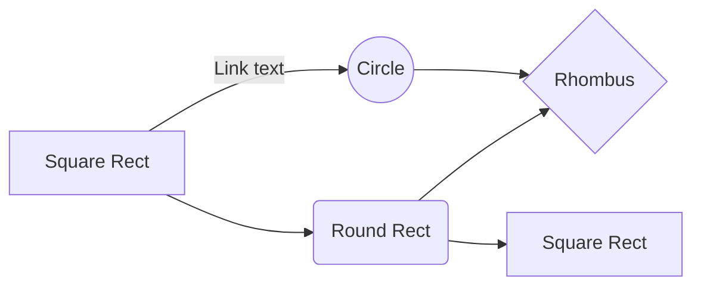

# AI Generated Interview Questions

## Background 🔦


ChatGPT has taken the world by storm. If you are not living under a rock, you might know what this is and it's insane capabilities. Artificial intelligence trying to mock human intelligence, OpenAI is the company behind it. They've exposed their API for developers to play with it albeit with limited usage.

I checked their API docs, there are around 50+ AI ideas you can try out including converting a language into another, generating keywords from a given paragraph, doing sentiment analysis on a tweet and much more! One of those models had the capability to generate interview questions related to a given technology.

This is being used in this project. It has limitations in terms of number of API calls and the response length which I believe is limited to 150 words called tokens. Below is a sample payload used to make this API call, this and much more examples can be found on their official website.

```
const headers = {
        'Content-Type': 'application/json',
        Authorization: `Bearer ${import.meta.env.VITE_OPENAI_API_KEY}`
      }
      
      
const jsonData = {
  "model": "text-davinci-003",
  "prompt": "8 interview questions in Python",
  "temperature": 0.5,
  "max_tokens": 150,
  "top_p": 1.0,
  "frequency_penalty": 0.0,
  "presence_penalty": 0.0
}
```

It expects authorization token in headers which you can obtain through registration on their portal. Next, beneath it is the actual payload which would be send under a Post request to the API end-point.

### Naive UI

It is one of the most popular UI libraries available for Vue 3 with almost 12K ★ on Github. It has support for Typescript and composition API. Though, in this app composition API has limited usage and Typescript hasn't been used at all.

In the future I might use this repository to have additional pages and play around with diverse components Naive UI has to offer.

## Why Vue 3 ?

Vue 3 is the future. Developers are making a transition from Vue 2 to Vue 3 and for a lot of good reasons. It has better support for Typescript, introduced composition API for better structuring of code based on modules and has refs to target DOM in efficient way.

# Tech Stack 🔥

* ✍🏻 Vue 3
* ✍🏻 Naive UI (UI Kit for Vue 3)
* ✍🏻 Docker (For deployment)
* ✍🏻 Nginx (For deployment)
* ✍🏻 OpenAI ChatGPT4

# Screenshots 🤳

Screenshots would be added later, not a lot of them. Just the homepage would be enough with search feature.

## Recommended IDE Setup for Vue and Vite

- [VS Code](https://code.visualstudio.com/) + [Volar](https://marketplace.visualstudio.com/items?itemName=Vue.volar) (and disable Vetur) + [TypeScript Vue Plugin (Volar)](https://marketplace.visualstudio.com/items?itemName=Vue.vscode-typescript-vue-plugin).


